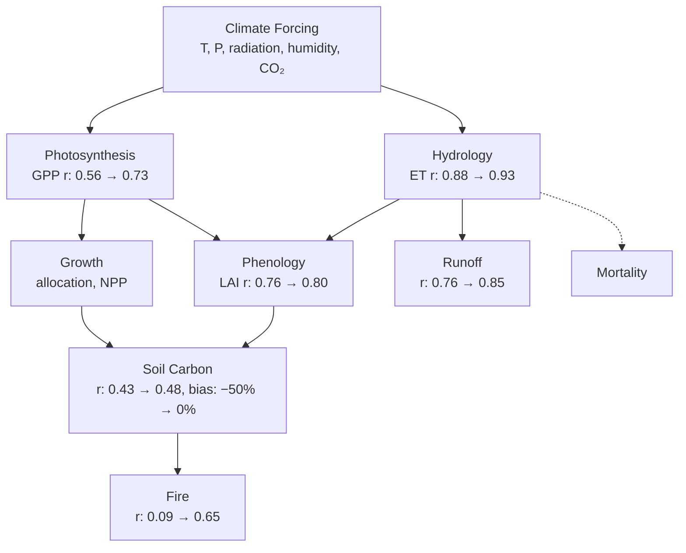

Earth system models simulate plant growth, fire, soil carbon cycling, and water fluxes globally. They contain hundreds of parameterized formulas governing these processes, many of which have remained structurally unchanged since their original publications in the 1980s and 1990s. Tuning the parameters of these formulas is the standard approach to model improvement, and it assumes the underlying equation is correct. In this work, we describe an autoresearch methodology that uses LLMs to systematically evaluate whether the formula _structure itself_ should be replaced, searching the joint space of equations and parameters against observational benchmarks, and maintaining physical interpretability throughout.

We applied this methodology to the [Ecosystem Demography model (ED v3.0)](https://gmd.copernicus.org/articles/15/1971/2022/) (Ma et al. 2022), an individual-based terrestrial biosphere model used for carbon cycle projections and land-use change studies. ED simulates every tree and grass cohort globally, computing photosynthesis, growth, mortality, phenology, soil carbon decomposition, hydrology, and fire disturbance at each timestep. The [International Land Model Benchmarking project (iLAMB)](https://www.ilamb.org/) (Collier et al. 2018) evaluates ED against 21 other models in the [TRENDY/GCB](https://globalcarbonbudget.org/) ensemble.

---

### Physical Grounding as a Design Constraint

Every formula proposed by the autoresearch system must correspond to a named physical process with published justification. Lloyd-Taylor (1994) for the temperature dependence of enzyme kinetics near freezing. Budyko (1974) for water-energy partitioning at the catchment scale. Monteith (1972) for the proportionality between intercepted radiation and plant growth. Hargreaves and Samani (1985) for estimating evaporative demand from diurnal temperature range. Zhang et al. (2001) for the vegetation-dependent partitioning of precipitation into evapotranspiration and runoff.

The LLM serves as a diagnostic engine, drawing on the ecological and biogeochemical literature to identify structural mismatches between model assumptions and observed spatial patterns. All formulas are expressed in basic arithmetic operations (exponential, logarithm, power, conditionals) and must be portable to the model's native C++ implementation. This constraint excludes neural networks, learned embeddings, and any representation that cannot be interpreted in terms of a physical mechanism.

---

### The Autoresearch Loop

The methodology follows a systematic cycle applied to each model module. The parameterized formula is extracted from the model's C++ source and replicated in Python, enabling fast evaluation over the global 0.5° grid (~1 second per evaluation). The Python replica is compared against gridded observational datasets ([HWSD](https://www.fao.org/soils-portal/data-hub/soil-maps-and-databases/harmonized-world-soil-database-v12/en/) for soil carbon, [GLEAM](https://www.gleam.eu/) for evapotranspiration, [GFED](https://www.globalfiredata.org/) for burned area, [FLUXCOM](https://www.fluxcom.org/) for gross primary productivity, [MODIS](https://modis.gsfc.nasa.gov/) for leaf area index, [LORA](https://geonetwork.nci.org.au/geonetwork/srv/eng/catalog.search#/metadata/f9617_9854_8096_5291) for runoff). The LLM then diagnoses _why_ the model disagrees with observations, drawing on physical reasoning to propose structural alternatives organized along defined axes.

<div class="row mt-3">
    <div class="col-sm mt-3 mt-md-0">
        
    </div>
</div>

Each axis represents a dimension of the formula's physical assumptions. For soil carbon decomposition, the axes include: (1) the temperature response function (Q10 vs. Lloyd-Taylor vs. Arrhenius vs. bell-curve), (2) the moisture response function (piecewise linear vs. log-parabolic vs. Michaelis-Menten with anaerobic suppression), (3) the pool structure (4-pool CENTURY vs. 3-pool vs. 2-pool), and (4) additional input variables (vegetation cover effects on soil temperature). Each alternative on each axis corresponds to a published model or physical mechanism.

The search over this combinatorial space of structures, combined with continuous parameter optimization within each structure, is performed using Bayesian optimization. Specifically, we use the [Tree-structured Parzen Estimator (TPE)](https://papers.nips.cc/paper/2011/hash/86e8f7ab32cfd12577bc2619bc635690-Abstract.html) (Bergstra et al. 2011) implemented in [Optuna](https://optuna.org/). TPE is a sequential model-based optimization algorithm that builds separate probability models of the parameter space for "good" and "bad" trials, then samples new trial points that maximize the ratio of these densities. This makes it efficient in mixed search spaces (categorical structural choices combined with continuous parameters) and practical at budgets of 500-2000 evaluations per module.

Each module receives a tailored multi-metric objective function reflecting what matters ecologically. Spatial correlation alone is insufficient. For hydrology, the objective includes water balance closure (precipitation must equal evapotranspiration plus runoff). For soil carbon, both stock accuracy (against HWSD) and flux accuracy (against Hashimoto et al. 2015 heterotrophic respiration) are weighted equally, with a bias penalty. For gross primary productivity, biome-level skill is weighted alongside global correlation, because a model that concentrates all productivity in the tropics while producing zero in boreal forests provides a misleading global mean.

---

### Following the Dependency Graph

The modules in ED form a directed dependency graph. Climate forcing drives photosynthesis, which feeds growth and hydrology. Hydrology governs soil moisture, which feeds back to phenology and soil carbon decomposition. Litter from growth and mortality enters the soil carbon pools. Fire is downstream of all other processes, depending on fuel load (biomass), fuel moisture (dryness), and seasonal productivity (GPP).



This dependency structure determined our optimization order and revealed constraints that single-module optimization would miss. An improvement to the photosynthesis module cascades to better litter input estimates, which in turn affect soil carbon predictions. Evapotranspiration and runoff share water balance as a conservation law: they cannot be optimized independently without risking physical inconsistency. We return to this cross-module consistency problem in a later section.

---

### Fire and the Intermediate Productivity Hypothesis

The fire module provided the initial proof of concept for the autoresearch methodology. ED's original fire formula computed burned area as a power-law function of above-ground biomass and a dryness index:

$$\text{fire} = \text{AGB} \times \left(\frac{\bar{D}}{\text{norm}}\right)^{\text{exp}}$$

This formulation assumes that fire risk increases monotonically with fuel load and dryness. Evaluation against [GFED4.1s](https://www.globalfiredata.org/) burned area (Randerson et al. 2017) yielded a spatial correlation of r = 0.09, effectively no skill.

The LLM diagnosis identified a well-documented ecological pattern that the formula structure fails to capture: fire occurrence peaks at intermediate levels of productivity (Pausas & Ribeiro 2013). Savannas burn frequently because they produce sufficient fuel during the wet season that cures during the dry season. Closed-canopy rainforests rarely burn because high humidity prevents fuel drying. Deserts and sparse shrublands lack fuel entirely. This intermediate productivity hypothesis requires a _unimodal_ response to biomass, which a monotonically increasing power law cannot represent.

The replacement formula couples a sigmoid ignition function with a unimodal fuel response:

$$\text{fire} = \frac{1}{1 + e^{-k(\bar{D} - D_0)}} \times \left(1 - e^{-\text{AGB}/b}\right) e^{-\text{AGB}/d}$$

The sigmoid captures the threshold behavior of fuel curing (a smooth transition from non-flammable to flammable as dryness accumulates). The hump-shaped fuel term peaks at intermediate biomass, consistent with the savanna fire regime. Spatial correlation improved to r = 0.41.

Incorporating GPP as a third input further improved the model to r = 0.65. GPP captures the seasonal productivity cycle through its linkage to stomatal conductance: high GPP during the growing season indicates active transpiration and fuel production, while subsequent dry-season GPP decline indicates fuel curing. For reference, published global fire models in the TRENDY ensemble typically achieve r = 0.5-0.7 against GFED.

$$\text{fire} = \text{sigmoid}(\bar{D}) \times \text{fuel\_hump}(\text{AGB}) \times \text{productivity\_hump}(\text{GPP})$$

This structural change, from a monotonic to a unimodal response, was the primary source of improvement. Parameter tuning within the original power-law structure yielded negligible gains.

---

### Decomposition and the Cold Soil Problem

ED's soil carbon decomposition follows a simplified [CENTURY model](https://www2.nrel.colostate.edu/projects/century/) (Parton et al. 1993) with four carbon pools (structural, fast, slow, passive) and a decomposition scalar that combines temperature and moisture effects:

$$T_d = R_0 \cdot Q_{10}^{(T - 25)/10}, \quad W_d = \text{piecewise}(\theta; 0.3, 0.6)$$

$$A = T_d \cdot W_d$$

The constants $$R_0 = 0.40$$, $$Q_{10} = 1.5$$, and the moisture breakpoints are hardcoded in the C++ source. They have never been tuned against observational soil carbon datasets.

The Q10 formulation assumes a fixed proportional increase in decomposition rate per 10°C warming. At low temperatures, this produces an exponentially declining curve that approaches zero at 0°C. Davidson and Janssens (2006) review the evidence that this formulation overestimates temperature sensitivity at low temperatures, where enzyme kinetics are better described by activation energy models. The Lloyd-Taylor (1994) response, derived from an Arrhenius framework with an empirical correction for enzyme behavior near freezing, asymptotically flattens below approximately 5°C:

$$T_d = R_0 \cdot \exp\left(E_0 \cdot \left(\frac{1}{56.02} - \frac{1}{T + 46.02}\right)\right)$$

```echarts
{
  "tooltip": {"trigger": "axis"},
  "legend": {"data": ["Q10 (original)", "Lloyd-Taylor (1994)"], "top": "5%"},
  "xAxis": {"type": "category", "name": "Temperature (°C)", "nameLocation": "center", "nameGap": 30, "data": ["-20","-15","-10","-5","0","5","10","15","20","25","30","35","40","45"]},
  "yAxis": {"type": "value", "name": "Decomposition rate", "nameLocation": "center", "nameGap": 40, "max": 1.0},
  "series": [
    {"name": "Q10 (original)", "type": "line", "smooth": true, "lineStyle": {"type": "dashed", "width": 2}, "data": [0,0,0,0,0,0.07,0.10,0.14,0.20,0.28,0.40,0.57,0.80,1.00], "itemStyle": {"color": "#e74c3c"}},
    {"name": "Lloyd-Taylor (1994)", "type": "line", "smooth": true, "lineStyle": {"width": 2}, "data": [0,0,0,0,0,0.03,0.05,0.09,0.15,0.24,0.38,0.58,0.84,1.00], "itemStyle": {"color": "#3498db"}}
  ],
  "grid": {"left": "12%", "right": "5%", "bottom": "15%"}
}
```

The key difference is visible in the 0-10°C range: Lloyd-Taylor rises more gradually from freezing, allowing cold soils to retain more carbon. This matches the observed pattern where boreal and arctic soils contain disproportionately large carbon stocks relative to their low temperatures.

Replacing Q10 with Lloyd-Taylor improved soil carbon predictions at high latitudes, where the original formulation allowed decomposition rates that were too high relative to the cold temperatures. We also replaced the piecewise-linear moisture response with a log-parabolic function (Moyano et al. 2013), which provides a smooth optimum without hard breakpoints:

$$W_d = \exp\left(-\frac{(\ln(\theta / \theta_{\text{opt}}))^2}{2\sigma^2}\right)$$

The optimized moisture parameter $$\sigma = 3.7$$ is very wide, indicating that moisture has a weak spatial modulating effect on decomposition at the global scale. Temperature dominates. This is consistent with the global synthesis of Bond-Lamberty and Thomson (2010).

We further simplified the four-pool CENTURY structure to a two-pool model (labile and stable carbon). The four-pool structure includes a passive pool that in ED is completely inert (decay rate K4 = 0, respiration fraction r = 0), meaning carbon enters but never leaves. Observational datasets (HWSD, NCSCD) report total soil carbon stocks and cannot constrain individual pool fractions. The two-pool structure avoids overfitting while representing the essential distinction between rapidly cycling litter carbon (turnover ~600 days) and slowly cycling humus (turnover ~115 years).

The global soil carbon bias decreased from −50% to effectively zero. Spatial correlation against HWSD improved from 0.43 to 0.48. At high latitudes, correlation against the [Northern Circumpolar Soil Carbon Database (NCSCD)](https://bolin.su.se/data/ncscd/) (Hugelius et al. 2014) improved from 0.11 to 0.19 after incorporating a vegetation gap-fill (discussed below).

---

### Closing the Water Balance

Evapotranspiration, runoff, and precipitation must satisfy a conservation law:

$$P = ET + R + \Delta S$$

At the annual timescale, changes in storage ($$\Delta S$$) are approximately zero, so precipitation should equal evapotranspiration plus runoff. When ET and runoff are optimized against their respective observational targets (GLEAM and LORA) using independently chosen formulations, this constraint can be violated. We found an 81 mm/yr global residual when using separately optimized models.

Joint optimization using a single ET formulation for both targets resolved this. We replaced ED's hourly Penman-Monteith scheme with the [Hargreaves PET estimate](https://elibrary.asabe.org/abstract.asp?aid=26773) (Hargreaves & Samani 1985) coupled to Zhang's [vegetation-dependent Budyko curve](https://doi.org/10.1029/2000WR900325) (Zhang et al. 2001), partitioned between soil evaporation and canopy transpiration using Beer's law interception:

$$\frac{ET}{P} = \frac{1 + w \cdot PET/P}{1 + w \cdot PET/P + P/PET}$$

The parameter $$w$$ controls the vegetation dependency. A higher $$w$$ means a larger fraction of precipitation is returned to the atmosphere through transpiration, reflecting the deeper rooting depth and higher canopy conductance of forests compared to grasslands. The optimized value $$w = 5.2$$ indicates strong vegetation control on the water balance. Canopy transpiration exceeds bare-soil evaporation by approximately 44% at the same atmospheric demand, consistent with eddy-covariance observations across biome gradients.

The joint optimization reduced the water balance residual from −81 to −3 mm/yr while maintaining ET correlation at r = 0.93 (against GLEAM) and runoff correlation at r = 0.83 (against LORA).

---

### The Vegetation Coverage Gap

Systematic evaluation across all modules revealed an unexpected finding: 22% of land cells where MODIS observes vegetation and HWSD reports soil carbon, the model initializes no vegetation. These cells are primarily high-latitude tundra and sparse boreal regions (50% of gap cells lie above 60°N, with mean annual temperature of −4.7°C). MODIS confirms real vegetation in these cells, with mean LAI of 0.34.

This gap propagates through the entire dependency graph. Absent vegetation means zero litter input to the soil carbon module, zero transpiration in the hydrology module, and zero fuel for the fire module. It represents 19% of global soil carbon stocks as reported by HWSD, a substantial fraction rendered invisible to the model.

We addressed this with a climate-based gap-fill model. For GPP, we used a [light-use efficiency formulation](https://doi.org/10.1641/0006-3568(2004)054[0547:ACSMOG]2.0.CO;2) (Running et al. 2004) driven by [CRU TS](https://crudata.uea.ac.uk/cru/data/hrg/) temperature and precipitation. For LAI, we used a biome-blended model based on the [Growing Season Index](https://doi.org/10.1111/j.1365-2486.2005.00930.x) (Jolly et al. 2005), with separate sub-models for temperature-limited (boreal), water-limited (arid), and energy-limited (tropical) regimes. The gap-fill extended the model's land coverage by 30% and improved high-latitude soil carbon correlation (against NCSCD) by 76%.

This finding illustrates a benefit of the autoresearch framework that extends beyond formula optimization. By forcing systematic evaluation of every module against gridded observations, systemic issues that span multiple modules become visible. The vegetation coverage gap was identifiable only by examining the intersection of soil carbon, ET, and GPP failures at the same grid cells.

---

### Summary of Ecological Changes

Across the model, the autoresearch methodology produced five structural changes, each representing a revised understanding of how an ecosystem process operates at the global scale.

| Module | Benchmark | Before | After | Change |
|--------|-----------|--------|-------|--------|
| Fire | GFED | 0.09 | **0.65** | +0.56 |
| GPP | FLUXCOM | 0.56 | **0.73** | +0.17 |
| Soil Carbon | HWSD | 0.43 | **0.48** | +0.05 |
| Soil C bias | HWSD | −50% | **0%** | eliminated |
| ET | GLEAM | 0.88 | **0.93** | +0.05 |
| Runoff | LORA | 0.76 | **0.85** | +0.09 |
| Phenology | MODIS | 0.76 | **0.80** | +0.04 |
| Water Balance | P=ET+R | −81 mm/yr | **−3 mm/yr** | closed |

<br>

| Process | Original Formulation | Replacement | Physical Rationale |
|---------|---------------------|-------------|-------------------|
| Fire disturbance | Power-law (AGB × dryness) | Sigmoid × unimodal hump | Intermediate productivity hypothesis (Pausas & Ribeiro 2013) |
| Decomposition temperature | Q10 (Parton et al. 1993) | Lloyd-Taylor (1994) | Enzyme kinetics flatten near freezing |
| Decomposition moisture | Piecewise linear | Log-parabolic (Moyano et al. 2013) | Smooth optimum, no hard breakpoints |
| Soil carbon pools | 4-pool CENTURY | 2-pool (labile + stable) | Observations cannot constrain 4 pools; passive pool was inert |
| Evapotranspiration | Penman-Monteith (hourly) | Hargreaves + Zhang Budyko | Vegetation-dependent water-energy partitioning |

In every case, the largest gains came from changing the functional form of the equation, informed by ecological reasoning about the physical process, rather than from tuning parameters within the original formulation.

Spatial cross-validation (5-fold, latitude-stratified) confirmed that the improvements generalize across regions: train-test correlation gaps were below 0.10 for 4 of 5 folds in all modules, with parameter counts of 2-11 against 50,000+ observation cells.

---

### Limitations and Generalization

The results presented here are based on steady-state approximations evaluated against gridded observational products. A full validation requires implementing the formula replacements in the coupled C++ model and re-running the simulation, because nonlinear feedbacks between modules may alter the results in ways that our modular optimization does not capture.

The steady-state assumption for soil carbon is particularly questionable at high latitudes, where permafrost soils are demonstrably out of equilibrium and contain vast carbon stocks that accumulated over millennia. The two-pool model cannot represent this legacy carbon without an explicit frozen-carbon mechanism. The boreal GPP problem, where no single formula adequately captures productivity across tropical, temperate, and boreal biomes simultaneously, remains partially addressed through the biome-blended approach but is fundamentally limited by the quality of the climate-based gap-fill at high latitudes.

The methodology itself generalizes to any parameterized model in the geosciences or beyond. The requirements are: (1) a set of parameterized formulas with physical interpretability, (2) gridded observational targets for evaluation, (3) domain literature from which the LLM can draw structural alternatives, and (4) a fast evaluation pathway (~1 second per trial). The deliverable is always interpretable, portable, and physically defensible. The formulas are the hypothesis. The full model re-run is the experiment.

---

### References

Allen, R.G., et al. (1998). Crop evapotranspiration. FAO Irrigation and Drainage Paper 56.

Bergstra, J., et al. (2011). Algorithms for hyper-parameter optimization. NeurIPS 25.

Bond-Lamberty, B. & Thomson, A. (2010). Temperature-associated increases in the global soil respiration record. Nature 464: 579-582.

Budyko, M.I. (1974). Climate and Life. Academic Press.

Collier, N., et al. (2018). The International Land Model Benchmarking (ILAMB) system. JAMES 10: 2731-2754.

Davidson, E.A. & Janssens, I.A. (2006). Temperature sensitivity of soil carbon decomposition and feedbacks to climate change. Nature 440: 165-173.

Hargreaves, G.H. & Samani, Z.A. (1985). Reference crop evapotranspiration from temperature. Applied Engineering in Agriculture 1: 96-99.

Hashimoto, S., et al. (2015). Global spatiotemporal distribution of soil respiration modeled using a global database. Biogeosciences 12: 4121-4132.

Hugelius, G., et al. (2014). Estimated stocks of circumpolar permafrost carbon. Biogeosciences 11: 6573-6593.

Jolly, W.M., et al. (2005). A generalized, bioclimatic index to predict foliar phenology. Global Change Biology 11: 619-632.

Lloyd, J. & Taylor, J.A. (1994). On the temperature dependence of soil respiration. Functional Ecology 8: 315-323.

Ma, L., et al. (2022). Global evaluation of the Ecosystem Demography model (ED v3.0). GMD 15: 1971-1994.

Monteith, J.L. (1972). Solar radiation and productivity in tropical ecosystems. Journal of Applied Ecology 9: 747-766.

Moyano, F.E., et al. (2013). Responses of soil heterotrophic respiration to moisture availability. Biogeosciences 10: 3961-3981.

Parton, W.J., et al. (1993). Observations and modeling of biomass and soil organic matter dynamics. Global Biogeochemical Cycles 7: 785-809.

Pausas, J.G. & Ribeiro, E. (2013). The global fire-productivity relationship. Global Ecology and Biogeography 22: 728-736.

Running, S.W., et al. (2004). A continuous satellite-derived measure of global terrestrial primary production. BioScience 54: 547-560.

Zhang, L., et al. (2001). Response of mean annual evapotranspiration to vegetation changes at catchment scale. Water Resources Research 37: 701-708.
